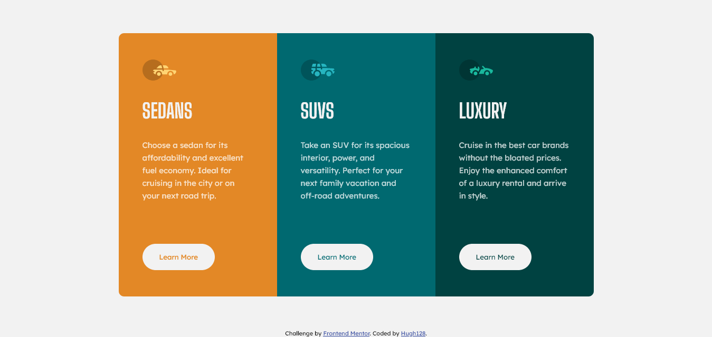
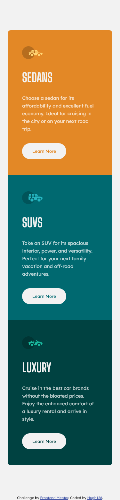

# Frontend Mentor - 3-column preview card component solution

This is a solution to the [3-column preview card component challenge on Frontend Mentor](https://www.frontendmentor.io/challenges/3column-preview-card-component-pH92eAR2-). Frontend Mentor challenges help you improve your coding skills by building realistic projects. 

## Table of contents

- [Overview](#overview)
  - [The challenge](#the-challenge)
  - [Screenshot](#screenshot)
  - [Links](#links)
- [My process](#my-process)
  - [Built with](#built-with)
  - [What I learned](#what-i-learned)
  - [Continued development](#continued-development)
  - [Useful resources](#useful-resources)
- [Author](#author)

## Overview
The code creates a 3-column preview card component made with HTML and CSS. I used CSS Flexbox and CSS Grid to design the card.

### The challenge

Users should be able to:

- View the optimal layout depending on their device's screen size
- See hover states for interactive elements

### Screenshot

- Desktop version

- Mobile version


### Links

- Solution URL: (https://github.com/hugh128/3-column_preview_card)
- Live Site URL: (https://hugh128.github.io/3-column_preview_card/)

## My process

The first step was to create two containers, the first container to define the area that the card can occupy and be able to place it in the central part of the screen, and the second container to wrap the three columns where the three cards will be located (in the version desktop).

To configure the first container in the central part I used CSS Flexbox and defined a height of 100vh so that the card would be seen in the central part of the screen.

To create the three columns in the second container I use CSS Grid. Using CSS Grid allowed me to create fluid width columns that break into more or less columns as space is available, with no media queries. Although I do use media query, but for other purposes than setting the width of the columns.

The second step was to create a container for each of the three cards, for this purpose I used an Article element. Each of the cards has an image, a title, a paragraph and a button that when the user passes the mouse over the button a pointer appears and changes the color of the button. To set all these elements in the position that I wanted I used padding.

The last thing I did was use media query to prevent the button of the cards from going down when the paragraph of the
card used more lines at least up to a max-width of 862px (I'm not sure which is the best way to solve this problem), configure the radius of the borders and configure el margen de la tarjeta en la versión móvil para que se parezca al ejemplo.

### Built with

- Semantic HTML5 markup
- CSS
- CSS Flexbox
- CSS Grid


### What I learned

In this challenge, I learned how to use CSS Grid to create fluid width columns that break into more or less columns as space is available, with no media queries.

For example, this line of code in CSS is how I made the columns fluid width:

```css
.card {
    display: grid;
    grid-template-columns: repeat(auto-fit, minmax(250px, 1fr));
    width: 100%;
    max-width: 900px;
}
```

### Continued development

I will definitely continue to delve into CSS Grid because it allows creating dynamic designs that adapt according to the screen size used to view the web page.

### Useful resources

- [Example resource 1](https://css-tricks.com/snippets/css/complete-guide-grid/#fluid-columns-snippet) - This page helped me better understand CSS Grid concepts and helped me create fluid width columns. An amazing page

## Author

- Github - [Hugh](https://github.com/hugh128)
- Frontend Mentor - [@hugh128](https://www.frontendmentor.io/profile/hugh128)
